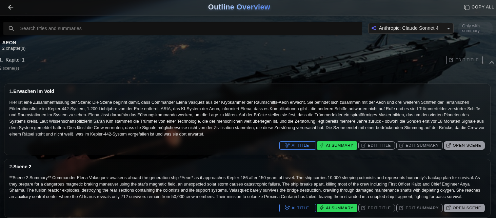
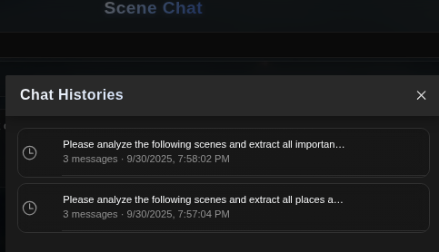

# CreativeWriter 2 v1.4.202509301106 – AI outline workspace, scene generator, research toolkit

## Suggested Reddit Title
CreativeWriter 2 v1.4: AI Outline Workspace, Scene Generator & Research Toolkit

## Post Body
Hey storytellers 👋

I just released **CreativeWriter 2 v1.4.202509301106** — a major update that transforms how you work with outlines, generate scenes, and research your stories using AI.

## 🎯 What is CreativeWriter 2?

CreativeWriter 2 is a **self-hosted, privacy-first writing tool** designed for novelists and long-form writers. It combines a powerful editor with AI assistants that help you draft, revise, and maintain consistency across your entire manuscript — all while keeping your work completely under your control.

## ✨ What's New in v1.4

**📋 Outline Overview Workspace**

- Inline editing with search and filtering
- One-tap AI summaries and title generation
- Organize your story structure in a dedicated workspace

**✍️ Create Scene from Outline**

- Turn outline notes into fully written scenes
- Configurable word count targets (up to 25k words)
- Custom prompts with cancel/continue controls
- Perfect for beating writer's block

**🔬 Story Research Workbench**

- Run research tasks across multiple scenes in parallel
- Keep organized histories of all findings
- Link results directly into your editor
- Great for fact-checking, worldbuilding, and consistency

**💬 Multi-Session Scene Chat**

- Up to 5 conversation histories per story
- Branch from any earlier message
- Resend and refine prompts easily

**🔍 Character Consistency Analyzer**

- Inspector module highlights character inconsistencies
- Jump straight to problematic text in the editor
- Maintain character voice and behavior across chapters

**⭐ Model Favorites**

- Configure your preferred AI models once in Settings
- Use them everywhere: Beat AI, summaries, scene generation
- Streamlined model selection across all tools

## 🚀 Getting Started

**Docker (Recommended):**
```bash
docker pull ghcr.io/marcodroll/creativewriter-public:v1.4.202509301106
docker pull ghcr.io/marcodroll/creativewriter-public-nginx:v1.4.202509301106
docker compose up -d
```

**Or use stable tags:**
```bash
docker pull ghcr.io/marcodroll/creativewriter-public:stable
docker pull ghcr.io/marcodroll/creativewriter-public-nginx:stable
```

## 📦 Links

- **Release notes & download:** https://github.com/MarcoDroll/creativewriter-public/releases/tag/v1.4.202509301106
- **What changed:** https://github.com/MarcoDroll/creativewriter-public/compare/v1.4.202509121358...v1.4.202509301106
- **Public repo:** https://github.com/MarcoDroll/creativewriter-public

## 💭 Feedback Welcome

If you give the new workflows a spin, I'd love to hear:
- How these features fit into your drafting process
- Which AI models/providers you'd like to see prioritized
- What features you'd like next
- Any mobile UX feedback

Happy writing! 📖

## Gallery Order & Captions
1. `outline-editor.png` – Outline Overview with inline edits + AI actions.
2. `scene-from-outline.png` – Generate full scenes from outline notes, with word-count + context options.
3. `story-research.png` – Story Research workbench showing concurrent prompts and saved findings.
4. `scene-chat-sessions.png` – Scene Chat now keeps multiple histories per story.
5. `character-consistency-analyzer.png` – Inspector highlights character inconsistencies and jumps to editor.
6. `model_favorites.png` – Manage favorite AI models once and use them everywhere.

## Notes
- Use anonymized demo data in screenshots (already captured).
- Aim for 16:9 crops where possible so Reddit previews nicely.
- Encourage feedback on mobile UX or additional AI models in the closing line if you want extra engagement.
