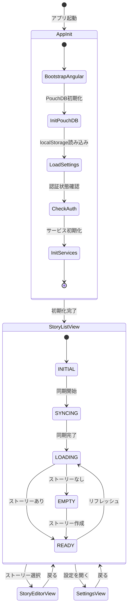
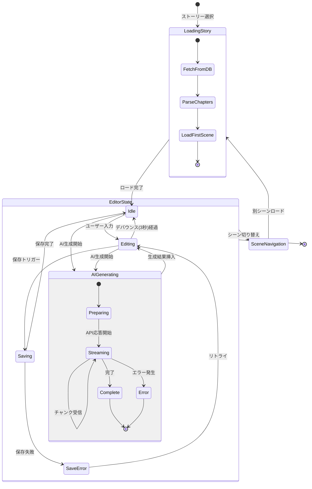
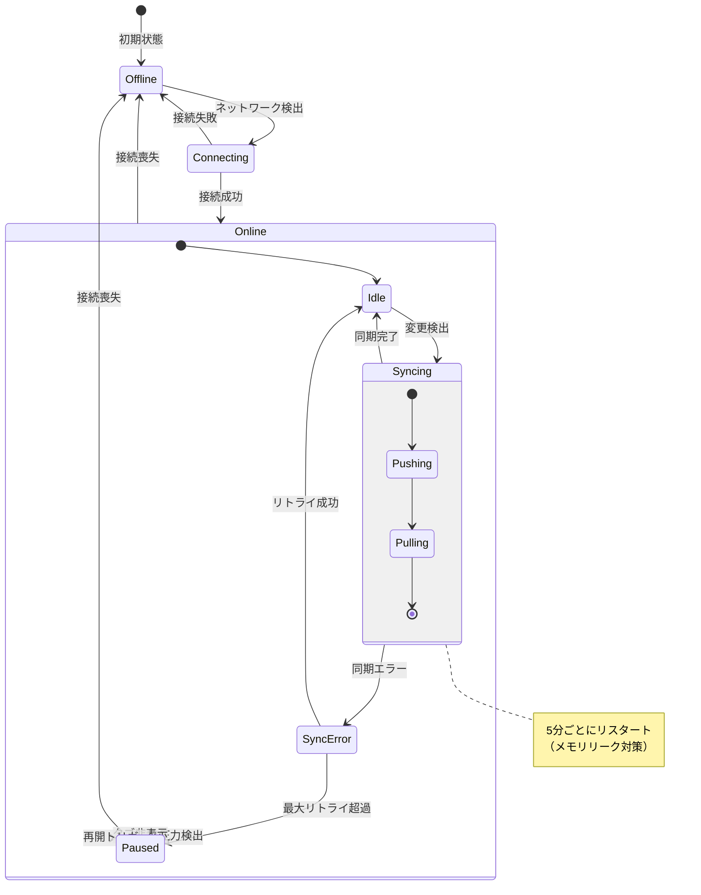
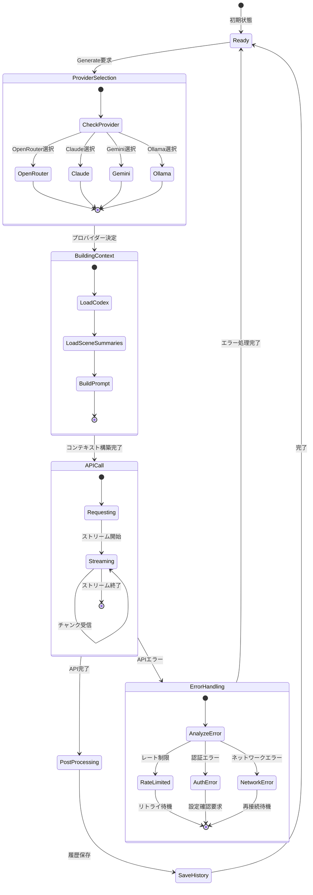
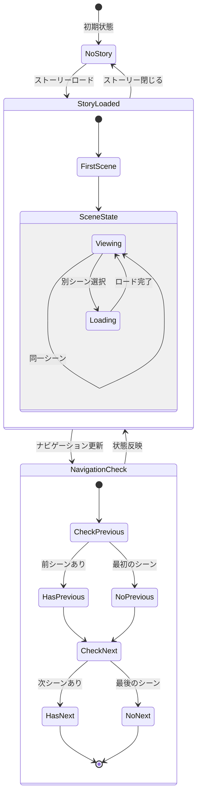
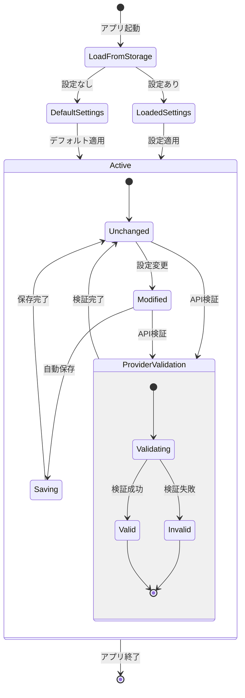
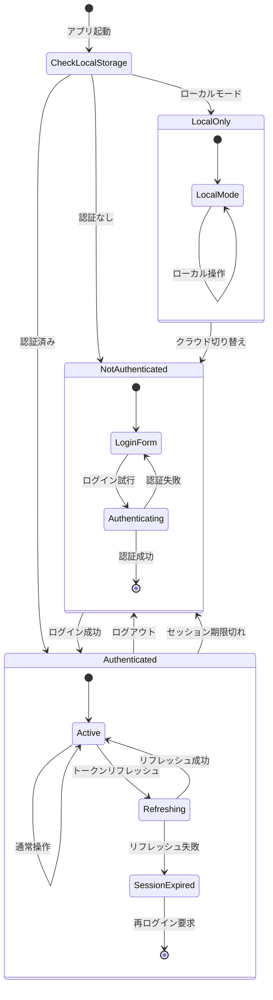
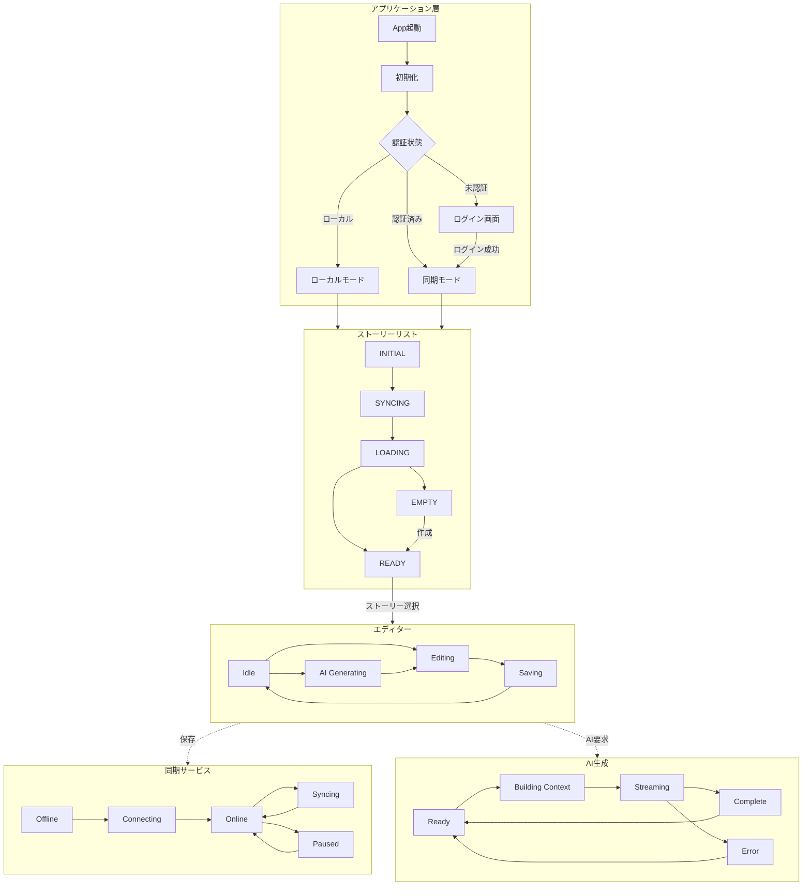

# CreativeWriter 2.0 ステートマシーン図

## 1. アプリケーション全体の状態遷移

## 2. ストーリーエディター状態遷移

## 3. 同期状態（DatabaseService）

## 4. AI生成状態（BeatAIService）

## 5. シーンナビゲーション状態

## 6. 設定状態（SettingsService）

## 7. 認証状態（AuthService）

## 8. 統合状態遷移図（概要）

## 状態の説明

### アプリ初期化
| 状態 | 説明 |
|------|------|
| BootstrapAngular | Angular フレームワーク起動 |
| InitPouchDB | ローカルデータベース初期化 |
| LoadSettings | localStorage から設定読み込み |
| CheckAuth | 認証状態確認 |
| InitServices | 各種サービス初期化 |

### ストーリーリスト
| 状態 | 説明 |
|------|------|
| INITIAL | 初期状態 |
| SYNCING | リモートDBと同期中 |
| LOADING | ローカルDBからロード中 |
| READY | ストーリー表示可能 |
| EMPTY | ストーリーなし |

### エディター
| 状態 | 説明 |
|------|------|
| Idle | 待機状態（変更なし） |
| Editing | 編集中（未保存変更あり） |
| Saving | 保存処理中 |
| AIGenerating | AI生成中 |

### 同期
| 状態 | 説明 |
|------|------|
| Offline | オフライン状態 |
| Connecting | 接続試行中 |
| Online/Idle | オンライン待機 |
| Syncing | 同期処理中 |
| Paused | 一時停止（メモリ/可視性） |

### AI生成
| 状態 | 説明 |
|------|------|
| Ready | 生成待機 |
| BuildingContext | コンテキスト構築中 |
| Streaming | ストリーミング受信中 |
| Complete | 生成完了 |
| Error | エラー発生 |
